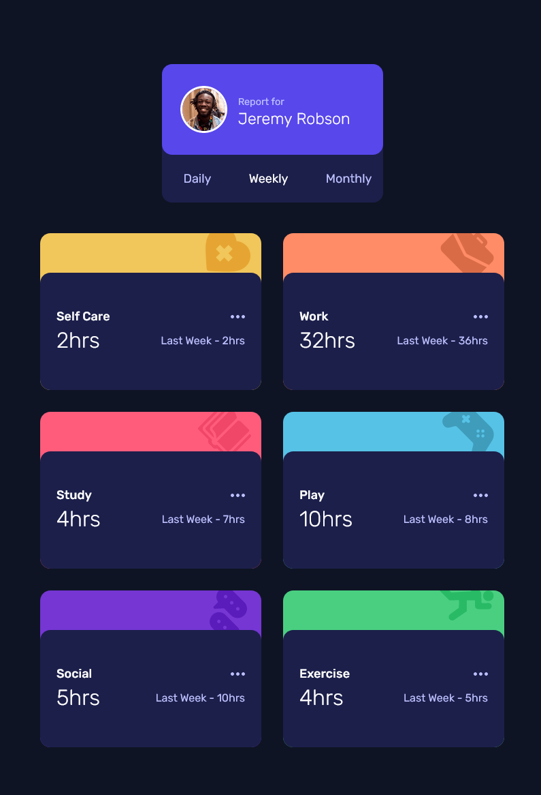

### Live Site URL: [GitHub Page](https://sunil-sharma-999.github.io/time-tracking-app/)

# Time tracking dashboard solution

This is a solution to the [Time tracking dashboard challenge on Frontend Mentor](https://www.frontendmentor.io/challenges/time-tracking-dashboard-UIQ7167Jw). Frontend Mentor challenges help you improve your coding skills by building realistic projects.

## Table of contents

- [Overview](#overview)
  - [The challenge](#the-challenge)
  - [Screenshot](#screenshot)
  - [Links](#links)
- [My process](#my-process)
  - [Built with](#built-with)
  - [Useful resources](#useful-resources)
- [Author](#author)

## Overview

### The challenge

Users should be able to:

- View the optimal layout for the site depending on their device's screen size
- See hover states for all interactive elements on the page
- Switch between viewing Daily, Weekly, and Monthly stats

### Screenshot

### Links

- Solution URL: [GitHub](https://github.com/sunil-sharma-999/time-tracking-app)
- Live Site URL: [GitHub Page](https://sunil-sharma-999.github.io/time-tracking-app/)

## My process

### Built with

- Semantic HTML5 markup
- CSS custom properties
- Flexbox
- CSS Grid
- Mobile-first workflow
- SCSS
- [React](https://reactjs.org/) - JS library

### Useful resources

- [Stack Overflow](https://stackoverflow.com)

## Author

- Websites / Socials - [Linktree](https://linktr.ee/Sunil.sharma.9)
